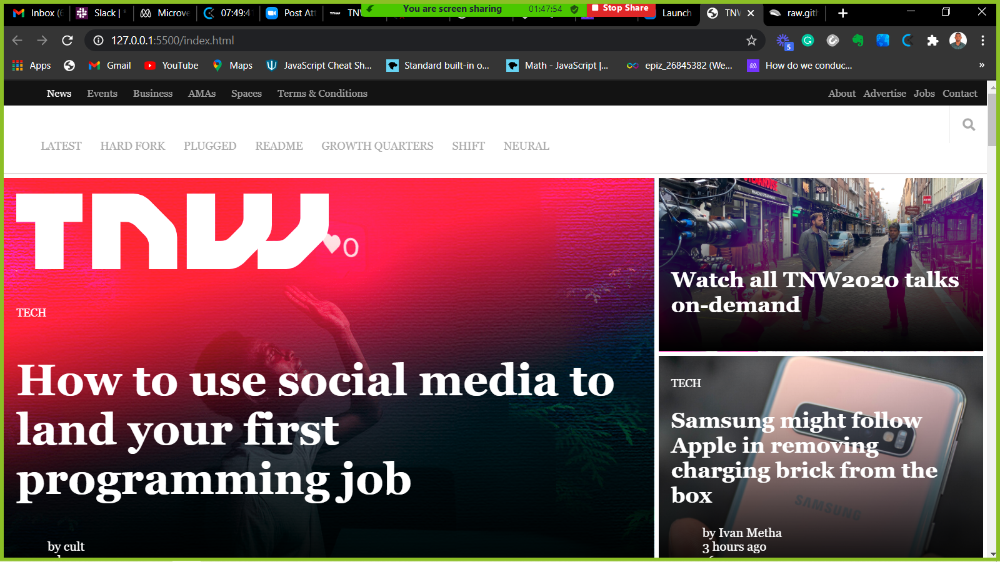

# Building with responsive design project
This project is a clone of the next web website main home page. In this project we are focussing on building using HTML and CSS, to make the page responsive to all screen sizes.

 Clone of a home page page from [The Next Web](https://thenextweb.com)
## Built With

- Html,
- CSS
- CSS,
- Linter,
- Vs code

## Live Demo
 [Live Demo Link]()

## Authors

- GitHub [Byabasaija](https://github.com/Byabasaija)    
 
  
- GitHub [rayKing12](GitHub.com/rayking12)

 Contributions, issues and feature requests are welcome! Start by:
* Push your branch up to your forked repository
* Open a Pull Request with a detailed description to the development branch of the original project for a review

## Show your support
Give a :star: if you like this project!
